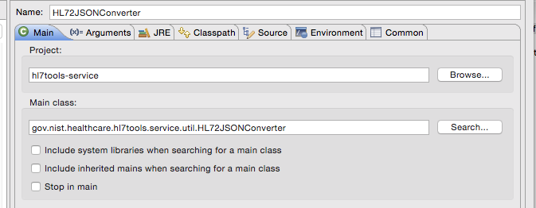
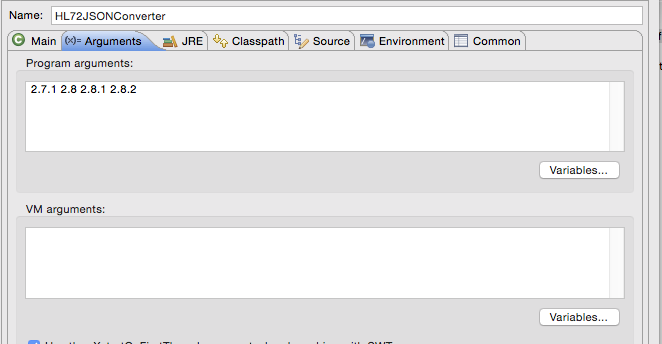
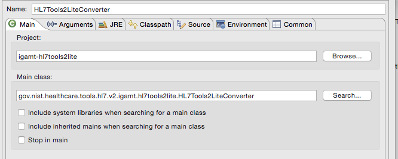
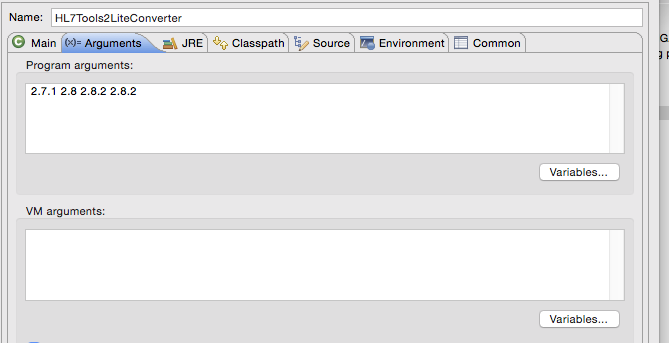

# Dependency of HL7Tools to IGAMT Lite

The HLTools to IGAMT Lite is a process for converting from an HL7 supplied database to the IGAMT database.

It is made up of three projects.

 1. igamt-hl7Tools-domain -- is a pure dependency.  It cannot be executed.  It must be installed into maven before either
project 2 or 3 can be executed. It provides the datastructures required by project 2.
 2. igamt-hl7Tools-service -- is executable from the command line.  It must be run then installed into maven before project 3 can be executed.  It reads from an instance of mySQL and writes *.json files to the 
resources directory of this project. The json files are required by project 3.
 3. igamt-hl7tools2lite -- is executable from the command line.  It reads the json files created by project 2, then populates the igamt database with their content.

# Procedure

***
## _Project 1_
### Install project 1 to the Maven repository:
Run maven install from inside eclipse.

***
## _Project 2_
Before this program can be run, one must transfer the following tables from the official HL7v2 standards database into a
mySQL database: 
* hl7messagetypes
* hl7versions
* hl7msgstructids
* hl7msgstructidsegments
* hl7segmentdataelement-
* hl7datastructures
* hl7datastructurecomponents
* hl7components
* hl7tablevalues
* hl7dataelements
* hl7tables
* hl7events
* hl7eventmessagetypes
	
The transfer process:

Use MS Access to export the tables to MS Excel work sheets.
Use MS Excel to export the work sheets to *.csv files.
Create a database in mySQL called mdb.
Import the *.csv files into mdb.
Inside eclipse, run gov.nist.healthcare.hl7tools.service.util.HL72JSONConverter with hl7 versions as arguments.
### Program to run:

### Program arguments:

### Install to the Maven repository:

One must run and install the above before running the converter (below). If not, the *.json files will be out of date.

### To run:
	 Run from inside the eclipse IDE.  In the launch configuration, pass versions as program arguments.
	 e.g. 2.1 2.2 2.3 
	
### Program outputs *.json files to the src/main/resources/hl7db/<version>

### To install:
	Run maven install from inside eclipse.

***
## _Project 3_
### Prerequisite:
	One must run the gov.nist.healthcare.hl7tools.service.util.HL72JSONConverter
	Install hl7tools-domain
	Install hl7toos-service
See the readme.md in the hl7tools-service project.
	

### To run:
	Maven update the igamt-hl7toos2lite project to ensure the latest dependencies are being used.
	Run from inside the eclipse IDE   In the launch configuration, pass versions as program arguments.
### Program to run:

### Program arguments:

 